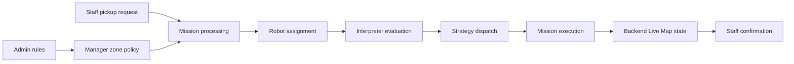

# Project Overview

## Project identity

**Name:** Smart Warehouse Robotics Decision Engine using Interpreter and Strategy Patterns

This graduation project simulates how warehouse robots can receive pickup missions, evaluate configurable operating rules, select a behavior, move through warehouse waypoints, return to Base Station, and expose their state to operational pages.

It is a Java Spring Boot educational prototype. It does not connect to physical robots, GPS, warehouse sensors, or production SAP/Amazon systems.

## Main idea

The application separates responsibilities across three roles:

1. Admin creates and maintains rule definitions.
2. Manager assigns active rules as zone policies and monitors robot workload.
3. Staff creates and operates pickup missions.
4. The backend selects an available robot and builds rule input from robot and mission data.
5. The Interpreter Pattern evaluates active rule expressions.
6. The Strategy Pattern dispatches the selected behavior.
7. The selected rule and strategy are stored on the mission.
8. The Live Map polls backend state and visualizes mission progress.

## Core architecture

| Concern | Implementation | Result |
| --- | --- | --- |
| Configurable conditions | `RuleParser`, `Expression` classes, `RuleService`, `RuleEvaluator` | Active rules are parsed and evaluated against a `Robot` context. |
| Behavior selection | `Strategy`, six strategy components, `StrategyContext` | A matched rule's strategy name produces a `StrategyResult`. |
| Operational workflow | `MissionService`, `MissionProcessingService`, `RobotAssignmentService` | Requests become assigned and executable missions. |
| Runtime simulation | `WarehouseRouteService`, `MissionExecutionProgressService`, battery/behavior services | Mission state is calculated from elapsed time and route waypoints. |
| Visualization | `StaffLiveMapController`, `LiveMapStateService`, `staff-live-map.js` | The browser polls `/staff/live-map/state` and renders returned DTO data. |

## Main modules and pages

| Module | Route | What it provides |
| --- | --- | --- |
| Dashboard | `/dashboard` | Robot, rule, strategy, and recent execution summary. |
| Rule Management | `/rules` | Create, edit, enable/disable, and delete rules. |
| Robot Management | `/robots` | Read-only fleet, battery, charging, and runtime strategy view. |
| Policy Assignment | `/manager/policy-assignment` | Assign an active Admin rule to Zone A, B, or C. |
| Robot Task Board | `/manager/robot-tasks` | Workload, queued missions, charging state, and cancelled mission details. |
| Pickup Request | `/staff/pickup-request` | Create a validated cargo pickup request. |
| Staff Missions | `/staff/missions` | Process, start, complete, stop, and soft-delete eligible missions. |
| Live Map | `/staff/live-map` | Show all robots or one selected robot using backend state. |
| Live Map state | `/staff/live-map/state` | Authenticated JSON state used by Live Map polling. |
| Simulation | `/simulation` | Evaluate manual robot input and display rule/condition traces. |
| System Flow | `/system-flow` | Explain the Interpreter-to-Strategy architecture using current data. |

## Current limitations

* Movement is a timeline and waypoint simulation, not real telemetry.
* Polling is used instead of WebSocket communication.
* Charging advances when state is read; there is no background scheduler.
* Authentication uses fixed in-memory demo accounts and is not production identity management.
* Runtime data uses local Microsoft SQL Server by default; the demo/test profiles use in-memory H2.
* The application is a graduation-project prototype, not a production warehouse control system.

Add the screenshot with this exact filename under `docs/images/`.
