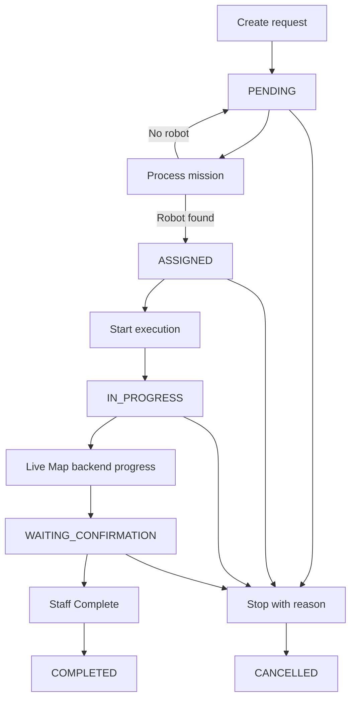

# Staff Workflow

## End-to-end flow

1. Log in with `Nova001 / nova001`.
2. Open **Create Pickup Request** at `/staff/pickup-request`.
3. Enter a request code or customer name.
4. Select cargo type. The server-provided mapping determines the zone and estimated `robotLoad`.
5. Select a location from the generated A1-A9, B1-B9, or C1-C9 grid.
6. Select priority and submit. `MissionService.createMission(...)` stores a `PENDING` mission.
7. Open **My Missions** at `/staff/missions`.
8. Select **Process**. `MissionProcessingService.processPendingMission(...)` selects a robot, evaluates rules, dispatches a strategy, stores the decision, and moves the mission to `ASSIGNED`. If no robot is available, it remains `PENDING`.
9. Select **Start Execution**. `MissionService.startExecution(...)` records the start time and changes the mission to `IN_PROGRESS`.
10. Open `/staff/live-map`. The browser polls `/staff/live-map/state` and shows robot movement to the target and back to Base Station.
11. On return, backend polling calls `MissionService.markReturnedToBase(...)`. The mission becomes `WAITING_CONFIRMATION` and its execution step becomes `RETURNED_TO_BASE`.
12. The robot becomes available for another task if charging is not required. It does not wait for Staff to click Complete.
13. Staff selects **Complete** later. `MissionService.completeMission(...)` closes the mission record as `COMPLETED`.
14. Staff may instead select **Stop**, but a valid cancellation reason is required.

## Cargo mapping

| Cargo type | Zone | Mission `robotLoad` input |
| --- | --- | ---: |
| Small Cargo | Zone A | 30 |
| Medium Cargo | Zone B | 60 |
| Large Cargo | Zone C | 90 |

The mapping is defined by `CargoType`, exposed by `MissionService`, and embedded into `staff-pickup-request.html`. `robotLoad` means estimated cargo load percentage, not zone size.

## Feature-to-code map

| Concern | Current code |
| --- | --- |
| Pickup form | `src/main/resources/templates/staff-pickup-request.html` |
| Mission list/actions | `src/main/resources/templates/staff-missions.html` |
| Mission detail | `src/main/resources/templates/staff-mission-detail.html` |
| Live Map page | `src/main/resources/templates/staff-live-map.html` |
| Pickup and mission routes | `StaffPickupRequestController` |
| Live Map page and JSON route | `StaffLiveMapController` |
| Mission validation/lifecycle | `MissionService` |
| Assignment + rule/strategy processing | `MissionProcessingService`, `RobotAssignmentService` |
| Route and time progress | `WarehouseRouteService`, `MissionExecutionProgressService` |
| Live state assembly | `LiveMapStateService` |
| Persistent state | `Mission`, `MissionStatus`, `MissionExecutionStep`, `Robot` |
| Persistence access | `MissionRepository`, `RobotRepository` |

Add the screenshot with this exact filename under `docs/images/`.

Add the screenshot with this exact filename under `docs/images/`.

Add the screenshot with this exact filename under `docs/images/`.
