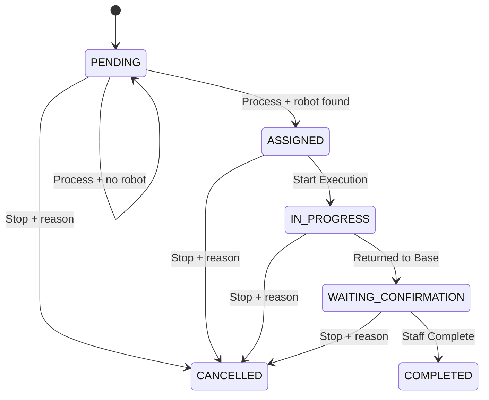

# Mission Lifecycle

The application uses two related state models:

* `MissionStatus` describes the business record.
* `MissionExecutionStep` describes the robot's position in an active route.

`CHARGING` is a robot status string, not a `MissionStatus` value.

## Business status transitions

| Status | Entered when | Allowed next actions | Important details |
| --- | --- | --- | --- |
| `PENDING` | `MissionService.createMission(...)` saves a request. | Process or Stop | Processing may leave it pending if no robot is available. |
| `ASSIGNED` | `MissionProcessingService.processPendingMission(...)` assigns a robot and stores a decision. | Start Execution or Stop | Rule and strategy output are already stored. |
| `IN_PROGRESS` | `MissionService.startExecution(...)` records execution start. | Backend return, or Staff Stop | Route progress is calculated from elapsed time and waypoints. |
| `WAITING_CONFIRMATION` | Backend progress reaches Base and `markReturnedToBase(...)` runs. | Complete or Stop | Robot availability is already resolved; Staff confirmation is still pending. |
| `COMPLETED` | Staff Complete passes backend return validation. | Read-only history | This closes the mission record. |
| `CANCELLED` | Staff Stop supplies a valid cancellation reason. | Soft Delete | Cancellation metadata remains visible until/after soft deletion in the database. |

There is no `STOPPED` enum value. The UI label "Cancelled / Stopped" maps to `MissionStatus.CANCELLED`.

## Execution steps

| `MissionExecutionStep` | Meaning |
| --- | --- |
| `NOT_STARTED` | Mission has not started moving. |
| `MOVING_TO_TARGET` | Robot is following outbound waypoints. |
| `PICKING_UP` | Robot is at the cargo slot during the pickup pause. |
| `RETURNING_TO_BASE` | Robot is following return waypoints. |
| `RETURNED_TO_BASE` | Robot has reached Base Station. |

`MissionExecutionProgressService.calculateProgress(...)` derives the step from `executionStartedAt`, route length, movement mode, and the current time. `LiveMapStateService` persists the returned state when polling observes `RETURNED_TO_BASE`.

## Return and confirmation separation

Returning to Base and Staff confirmation are intentionally separate:

1. Backend progress reaches Base Station.
2. `MissionService.markReturnedToBase(...)` stores `WAITING_CONFIRMATION`, `RETURNED_TO_BASE`, `base-station`, and `returnedAt`.
3. `RobotChargingService.updateRobotAvailabilityAfterMissionReturn(...)` makes the robot `IDLE` if charging is not needed, or starts charging if it is needed.
4. A non-charging robot can receive another mission immediately.
5. Staff Complete later changes only the waiting mission record to `COMPLETED` and stores `completedAt`.

Both the UI and backend block early completion. `MissionService.isMissionReadyForCompletion(...)` and `completeMission(...)` require return evidence.

## Code map

| Concern | File/class |
| --- | --- |
| Business enum | `src/main/java/com/warehouse/model/MissionStatus.java` |
| Route-step enum | `src/main/java/com/warehouse/model/MissionExecutionStep.java` |
| Persistent fields and eligibility helpers | `src/main/java/com/warehouse/model/Mission.java` |
| Lifecycle operations | `src/main/java/com/warehouse/service/MissionService.java` |
| Mission decision processing | `src/main/java/com/warehouse/service/MissionProcessingService.java` |
| Timeline calculation | `src/main/java/com/warehouse/service/MissionExecutionProgressService.java` |
| Return detection during polling | `src/main/java/com/warehouse/service/LiveMapStateService.java` |
| Staff action routes | `src/main/java/com/warehouse/controller/StaffPickupRequestController.java` |
| Status/action UI | `staff-missions.html`, `staff-mission-detail.html`, `staff-live-map.html` |

Add the screenshot with this exact filename under `docs/images/`.
