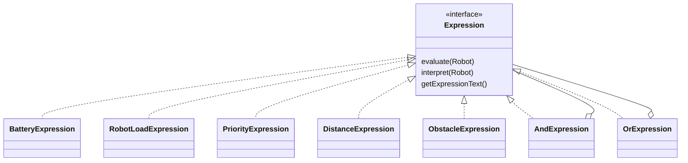

# Rule Engine and Interpreter Pattern

## Why the pattern is used

Warehouse conditions are stored as rule text instead of being hardcoded into controller branches. The Interpreter Pattern converts each supported condition into an `Expression` object and evaluates it against a `Robot` context.

Examples supported by the current parser:

```text
battery < 20
robotLoad >= 80
priority == 1
obstacleDetected == TRUE
distance > 50
battery < 20 AND priority == 1
obstacleDetected == TRUE OR distance > 15
```

Supported numeric operators are `<`, `>`, `<=`, `>=`, and `==`. Logical keywords are `AND` and `OR`, case-insensitively. Optional `IF ... THEN ...` wrapper text is normalized away.

Limitations: parentheses and arbitrary identifiers are not supported. `battery`, `robotLoad`, and `priority` require whole-number thresholds; `distance` may use a decimal threshold.

## Expression structure



| Class | Responsibility |
| --- | --- |
| `Expression` | Common evaluation contract. |
| `BatteryExpression` | Compares `Robot.battery`. |
| `RobotLoadExpression` | Compares `Robot.robotLoad`. |
| `PriorityExpression` | Compares `Robot.priority`. |
| `DistanceExpression` | Compares `Robot.distance`. |
| `ObstacleExpression` | Compares `Robot.obstacleDetected` with TRUE/FALSE. |
| `AndExpression` | Matches when every child expression matches. |
| `OrExpression` | Matches when any child expression matches. |
| `ExpressionEvaluation` | Stores the expression result tree and exposes leaf results. |

## Evaluation flow

1. `RuleRepository.findByActiveStatusTrueOrderByPriorityAscRuleNameAsc()` loads active rules.
2. `RuleService.evaluateRules(...)` evaluates them in that order.
3. `RuleParser.parse(...)` creates a leaf or logical expression tree.
4. `Expression.evaluate(...)` returns `ExpressionEvaluation` with TRUE/FALSE children.
5. `RuleEvaluationResult` stores rule priority, rule name, normalized condition, match state, target strategy, and expression trace.
6. `RuleEngineResult` selects the first matched result.
7. `RuleEvaluator.evaluate(...)` exposes this process to simulation and mission processing.

Lower numeric priority means earlier evaluation and normally higher selection priority. In mission processing, a matching Manager-assigned zone policy may intentionally override the normal first match; if that policy does not match, the normal first matched active rule is used.

There is no class named `RuleEngine` in the current codebase. The engine behavior is implemented by `RuleService`, `RuleEvaluator`, and the result classes `RuleEngineResult`/`RuleEvaluationResult`.

## How mission data becomes rule input

`MissionProcessingService.buildEvaluationRobot(...)` creates a decision context:

| Input | Source |
| --- | --- |
| `battery` | Selected robot's persisted battery, defaulting to 100 only if null. |
| `obstacleDetected` | Selected robot's current flag. |
| `robotLoad` | Cargo mapping from `CargoType`. |
| `distance` | Zone base distance plus the A1-C9 location index. |
| `priority` | Mission priority. |

`robotLoad` is estimated cargo load percentage:

| Cargo | `robotLoad` |
| --- | ---: |
| Small Cargo | 30 |
| Medium Cargo | 60 |
| Large Cargo | 90 |

The current seeded Heavy Load rule uses `robotLoad > 80`, so only Large Cargo
matches it. Changing that condition to `robotLoad >= 60` allows both Medium and
Large Cargo to select `HeavyLoadStrategy`.

## Exact files

All Interpreter classes are under `src/main/java/com/warehouse/interpreter/`. Rule orchestration is in `src/main/java/com/warehouse/service/RuleService.java`; mission input assembly is in `MissionProcessingService.java`; persisted rule data is in `Rule.java` and `RuleRepository.java`.


Add the screenshot with this exact filename under `docs/images/`.


Add the screenshot with this exact filename under `docs/images/`.
