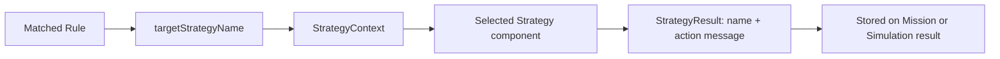

# Strategy Pattern

## Why the pattern is used

After rule evaluation selects a strategy name, the Strategy Pattern chooses the corresponding robot behavior without placing behavior-specific branches in controllers.

`StrategyContext` receives all Spring components implementing `com.warehouse.strategy.Strategy`, indexes them by `getStrategyName()`, and calls `execute(Robot)` for the selected name.

## Implemented strategies

| Strategy component | Immediate `StrategyResult` meaning | Mission runtime effect |
| --- | --- | --- |
| `FastRouteStrategy` | Select fastest available route. | `FAST` movement; faster timing and faster battery drain. |
| `EnergySavingStrategy` | Reduce speed to preserve battery. | `ENERGY_SAVING` movement; slower timing and slower drain. |
| `HeavyLoadStrategy` | Reduce speed and request a heavy-load route. | `HEAVY_LOAD` movement, especially on cargo return. |
| `ObstacleAvoidanceStrategy` | Slow down and recalculate around obstacle. | Obstacle-avoidance mode; bridge waiting can activate it temporarily. |
| `ChargingStrategy` | Route robot to charging behavior. | Current mission still runs; charging is required after return. |
| `SafeRouteStrategy` | Use a route with lower collision risk. | `SAFE` movement mode using normal timing/drain values. |

The interface is `Strategy`; results use `StrategyResult`. `RobotBehaviorStrategy` exists as an empty sub-interface but current concrete components implement `Strategy` directly.

## Fallback behavior

There is no `DefaultStrategy` class in the current codebase. If `StrategyContext` cannot find a requested strategy, it returns a `StrategyResult` named `NoStrategy`. When a mission has no stored selected strategy, runtime visualization uses the internal label `NormalStrategy`; this is not a Spring strategy component.

## Primary versus current active strategy

`RobotExecutionBehaviorService` separates two values returned by Live Map:

* **Primary strategy:** `Mission.selectedStrategyName`, originally selected by rule evaluation.
* **Current active strategy:** behavior currently displayed/applied for the route phase.

Examples:

* A `FastRouteStrategy` mission normally has Fast as both primary and active behavior.
* A robot waiting because another mission occupies a critical bridge temporarily reports `ObstacleAvoidanceStrategy`, then resumes its primary strategy.
* Large Cargo can report `HeavyLoadStrategy` during the return phase even when another strategy was primary.
* A rule-selected `ChargingStrategy` remains the primary strategy, but mission movement uses normal or low-battery energy-saving movement until the robot returns; charging then becomes the active robot state.

## Rule-to-real-mission connection

1. `MissionProcessingService` builds the evaluation robot.
2. `RuleEvaluator` returns a selected rule.
3. `StrategyContext.executeStrategy(...)` creates the action result.
4. The mission stores `matchedRuleName`, `selectedStrategyName`, `actionMessage`, and `decisionSummary`.
5. `RobotExecutionBehaviorService` reads `selectedStrategyName` during Live Map progress.
6. Movement timing and battery drain use the derived `RobotMovementMode`.
7. A charging strategy can trigger `RobotChargingService` after return.

## Exact files

Strategy components are in `src/main/java/com/warehouse/strategy/`. Runtime phase behavior is in `src/main/java/com/warehouse/service/RobotExecutionBehaviorService.java`. Dispatch call sites are `MissionProcessingService` and `SimulationService`.

Add the screenshot with this exact filename under `docs/images/`.

Add the screenshot with this exact filename under `docs/images/`.
