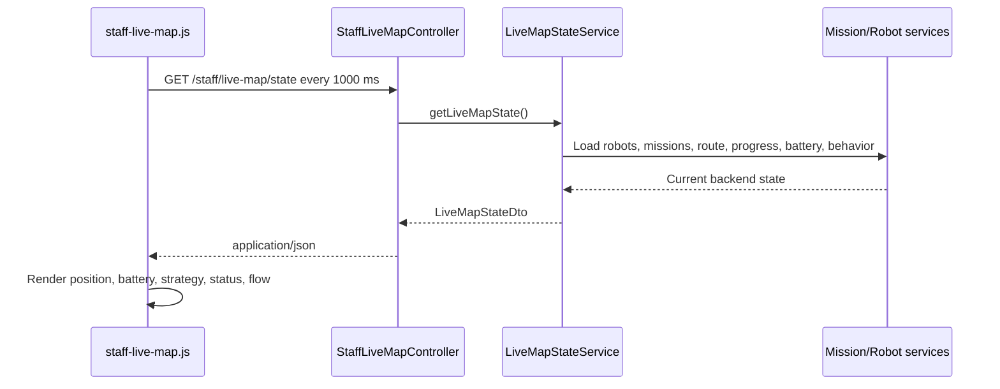

# Live Map Simulation

## Routes and files

| Purpose | Current implementation |
| --- | --- |
| HTML page | `GET /staff/live-map` |
| JSON state | `GET /staff/live-map/state` |
| Controller | `StaffLiveMapController` |
| State service | `LiveMapStateService` |
| State DTOs | `LiveMapStateDto`, `LiveMapRobotStateDto`, `LiveMapRouteStepDto` |
| Template | `src/main/resources/templates/staff-live-map.html` |
| JavaScript | `src/main/resources/static/js/staff-live-map.js` |
| CSS | `src/main/resources/static/css/staff-live-map.css` and shared `app.css` |

## Backend-driven state flow

The JavaScript uses the relative endpoint `/staff/live-map/state`, a one-second interval, and an in-flight request guard. If polling fails, it keeps the last known visual positions.

`LiveMapStateService`:

1. loads persisted robots and active missions;
2. chooses the current mission per robot;
3. builds warehouse route waypoints;
4. calculates elapsed-time execution progress;
5. applies bridge occupancy waiting;
6. calculates/persists traveled-route battery state;
7. derives primary/current strategy behavior;
8. persists returned-to-Base state when reached;
9. returns DTOs for rendering.

The frontend does not replace DTO state with fake mission values. It contains static warehouse geometry and display definitions for the three seeded demo robots, but polled backend fields drive mission, position, battery, strategy, charging, status, and messages.

## Display modes

### Show All Robots

This is the default mode. It clears the selected robot and renders all known robot markers in the warehouse view.

### Selected Robot View

Selecting Picker Alpha, Mover Beta, or Carrier Gamma focuses its current zone and shows its mission flow, battery, strategy, target, status, and route state.

### Visual preview

When a selected robot has a target but backend execution is not active, the page can run a clearly labelled client-side route preview. The preview does not change mission status or write backend data. During active backend execution, the page follows polled state instead.

## Route model

`WarehouseRouteService` builds deterministic waypoint sequences from Base Station through Zone C, optionally Zone B and Zone A, to slots A1-C9 and back. `MissionExecutionProgressService` interpolates between current and next waypoint using elapsed time. Base Station is the normal start/end point; charging robots are displayed at `charging-station`.

## Limitations

* No GPS or physical robot coordinates are used.
* No WebSocket is implemented.
* Progress depends on server time, stored execution start, movement mode, and fixed waypoint durations.
* The endpoint is authenticated and intended for the demo UI, not a public robotics API.
* State reads can persist battery progress, return-to-Base state, and charging completion; polling is therefore part of the simulation loop.

Add the screenshot with this exact filename under `docs/images/`.

Add the screenshot with this exact filename under `docs/images/`.
