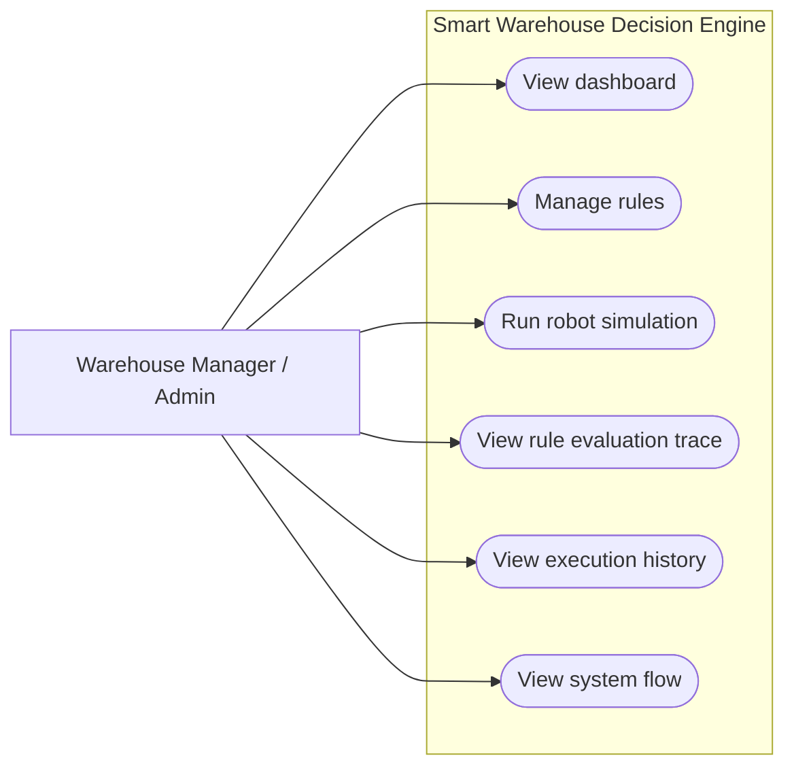
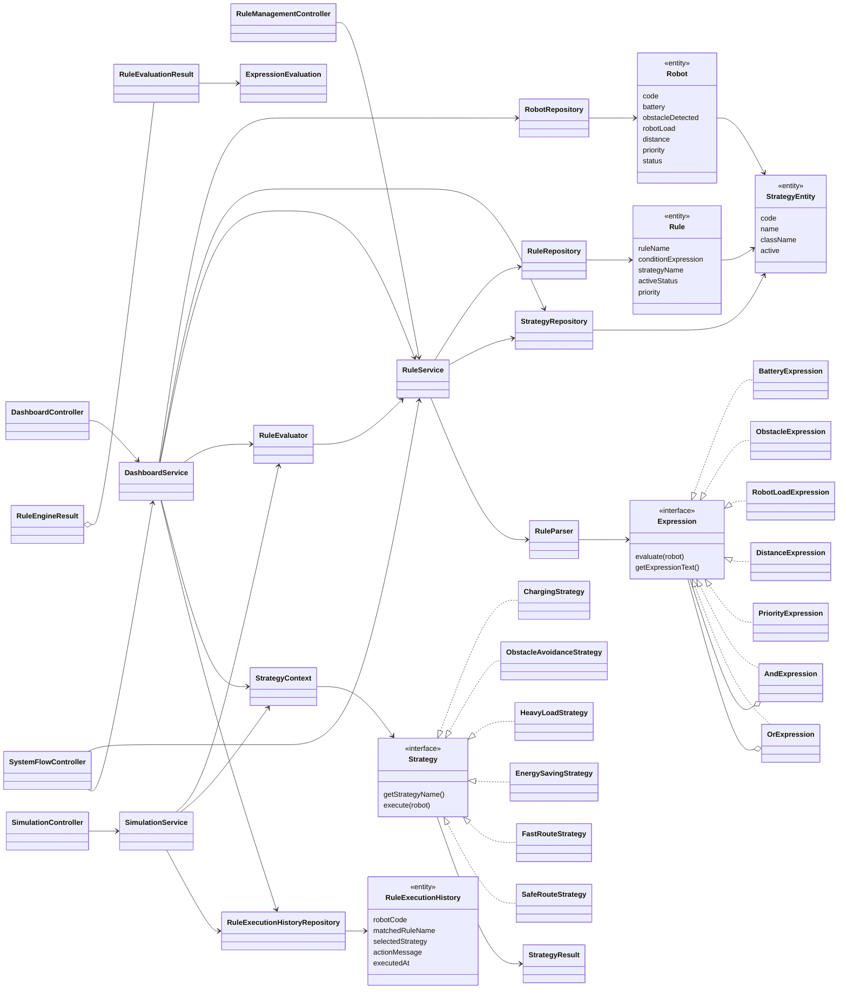
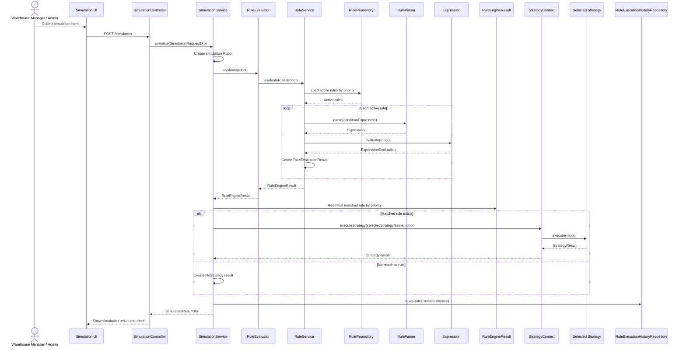
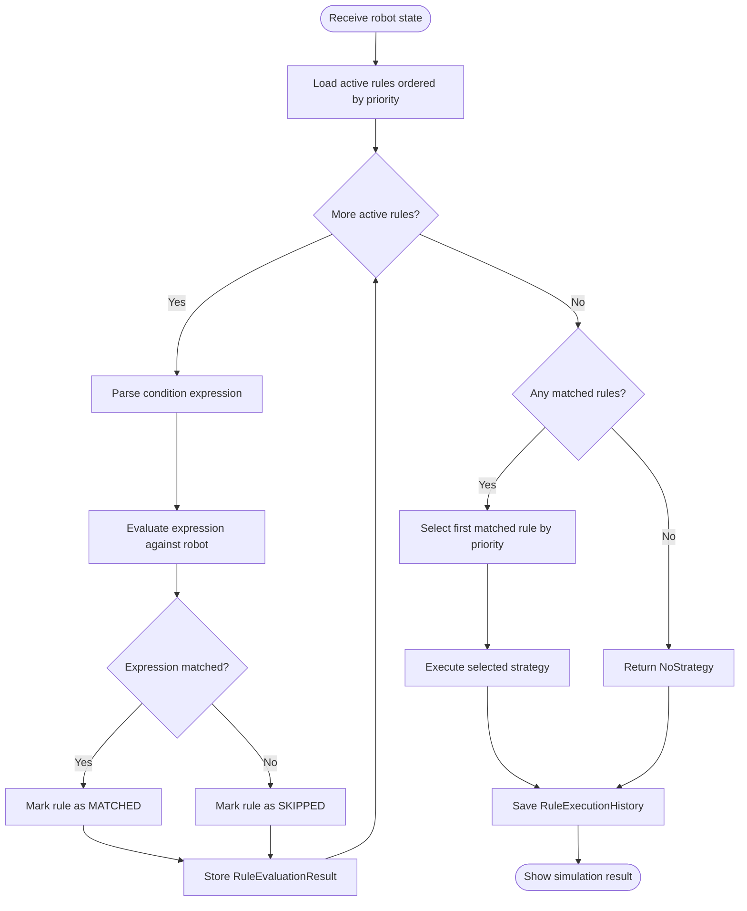

# UML Diagrams

These diagrams summarize the final architecture of the Smart Warehouse Robotics Decision Engine. They are written in Mermaid so they can render in Markdown tools that support Mermaid diagrams.

These diagrams focus on the original decision-engine core. For the complete
current role workflow and source map, use the [Documentation Index](README.md),
[Mission Lifecycle](05-mission-lifecycle.md), and [Central Code Map](12-code-map.md).

## Use Case Diagram

## Class Diagram

The project contains two different Java types named `Strategy`:

* `com.warehouse.strategy.Strategy` is the Strategy Pattern interface.
* `com.warehouse.model.Strategy` is shown as `StrategyEntity` in the diagram because it is the persisted database entity.

## Sequence Diagram: Simulation Flow

## Activity Diagram: Rule Evaluation

